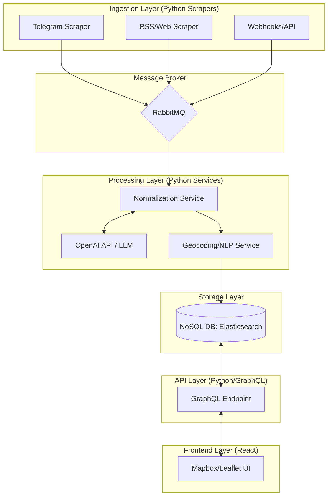

# OSINT Map Project Architecture

## System Overview
The system is designed to ingest, process, and visualize OSINT data from various sources (Telegram, RSS, Web Scraping) in a unified map-based interface.

### Data Flow Breakdown

1.  **Ingestion**: Scrapers extract raw data (JSON/XML/Text) and publish it to a **RabbitMQ** queue.
2.  **Queueing**: RabbitMQ buffers bursts of data and ensures messages aren't lost if the processing service is down.
3.  **Normalization & Enrichment (OpenAI)**: 
    - The **Normalization Service** consumes raw messages.
    - It sends unstructured text to **OpenAI (GPT-4o/o1)** to extract entities, summarize content, and identify potential location names from the text.
4.  **Geocoding**: The **Geocoding Service** takes the location names identified by the LLM and converts them into precise coordinates using a GIS provider (e.g., Nominatim, Google Maps, or Mapbox).
5.  **Storage**: The final enriched record is stored in **Elasticsearch** (optimized for geo-spatial and full-text search).
6.  **Delivery**: The **React Frontend** requests data via **GraphQL**, allowing it to fetch only the fields needed for the current map viewport.

## Cost Optimization

To manage the costs of high-volume OSINT data processing, the following strategies are employed:

- **Model Selection**: Use **GPT-4o-mini** for 95% of extraction and normalization tasks. It offers a 90%+ cost reduction compared to GPT-4o while maintaining high accuracy for entity extraction.
- **Batch Processing**: For non-time-critical sources (e.g., historical RSS archives), use the **OpenAI Batch API** to receive a 50% discount on token costs.
- **Pre-filtering**: Implement a lightweight rule-based or local LLM (e.g., Llama 3 via Ollama) filter in the **Normalization Service** to discard "noise" (ads, spam, irrelevant chatter) before sending content to OpenAI.
- **Caching**: Implement a hashing mechanism to avoid re-processing identical or highly similar messages across different channels.
- **Geocoding Efficiency**: Only call geocoding APIs (e.g., Mapbox, Google) for unique location strings identified by the LLM, caching coordinates locally in a persistent lookup table.

## Sprint 1: Core Implementation (Walking Skeleton)

The first sprint focuses on establishing the end-to-end "Walking Skeleton" of the system: a single message flowing from a source to the map.

### 1. Ingestion: Telegram Scraper
- **Goal**: Implement a basic Python service using `Telethon` or `Pyrogram`.
- **Scope**: Monitor **one** public Telegram channel and publish raw message JSON to a RabbitMQ queue (`raw_events`).

### 2. Infrastructure: Core Services
- **Goal**: Spin up required infrastructure using Docker Compose.
- **Services**: RabbitMQ (Management UI enabled) and Elasticsearch (Single-node).

### 3. Processing: Minimal Normalization Service
- **Goal**: Consume from `raw_events` and produce a normalized event.
- **Logic**:
    - Use **GPT-4o-mini** to extract location names from the text.
    - Use **Nominatim (OpenStreetMap)** for simple, free geocoding of the extracted names.
    - Save the result to an Elasticsearch index (`osint_events`).

### 4. Frontend: Basic Map Display
- **Goal**: Visualize the events on a map.
- **Scope**:
    - A React application using **Leaflet** (OpenSource) or **Mapbox GL JS**.
    - Fetch the last 50 events from Elasticsearch and display them as simple markers.
    - Display a popup with the original text and the LLM summary.
