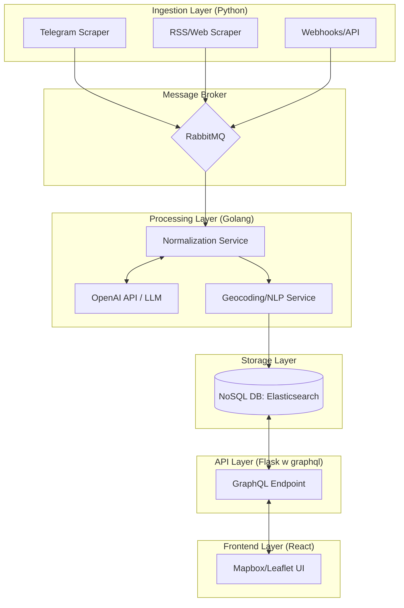

# OSINT Map Project Architecture

## System Overview
The system is designed to ingest, process, and visualize OSINT data from various sources (Telegram, RSS, Web Scraping) in a unified map-based interface.

### Data Flow Breakdown

1.  **Ingestion**: Scrapers extract raw data (Free Text / structured data), test against gpt5-nano that its a relevant event, and publish it to a **RabbitMQ** queue.
2.  **Queueing**: Decouples data ingestion and processing. Also provides the benfit of buffering events in case the processing service is busy / falls for some reason.
3.  **Processing Service (OpenAI & Geocoding)**: 
    - The **Processing Service** consumes raw messages.
    - It sends unstructured text to **OpenAI (GPT5-mini)** to extract entities, summarize content, and identify potential location names from the text.
4.  **Nominatim - Geocoding**: The **Geocoding Service** takes the location names identified by the LLM and converts them into precise coordinates.
5.  **Storage**: The final enriched record is stored in **Elasticsearch** (optimized for geo-spatial and full-text search).
6.  **Delivery**: The **React Frontend** requests data via **GraphQL** from a dedicated backend service. The service provides queries, SSE for real time updates etc.

## Cost Optimization

To manage the costs of high-volume OSINT data processing, the following strategies are employed:

- **Model Selection**: Use **GPT5-nano** for event classificatons and **GPT5-mini** for extraction and summarization.
**Ingestion Layer** discards irrelevant events before pushing to the rabbitmq.
