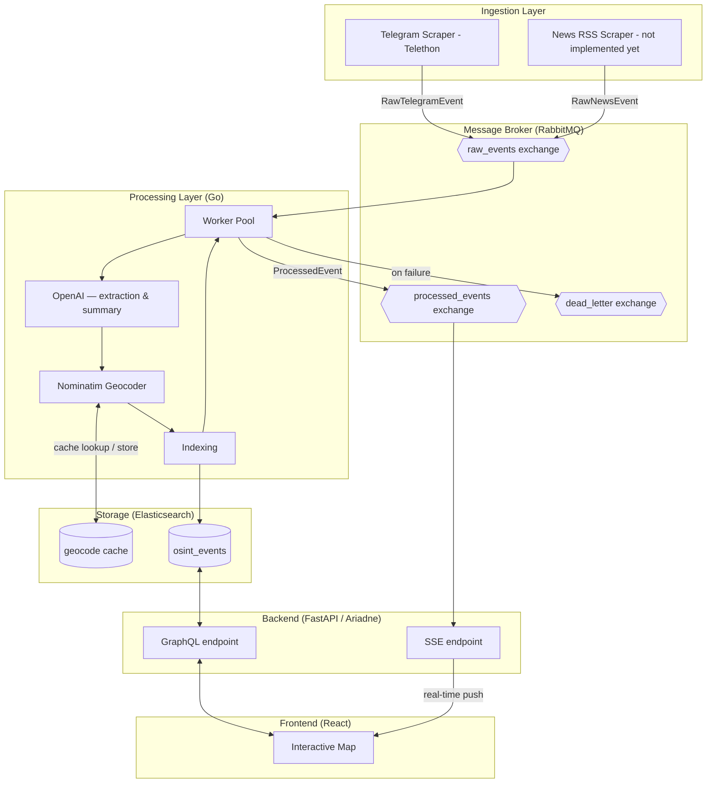

# OSINT Map Project Architecture

## System Overview
The system ingests, processes, and visualizes OSINT data from Telegram channels on an interactive map in real time.

```mermaid
graph TD
    %% Ingestion Layer
    subgraph Ingestion ["Ingestion Layer"]
        T[Telegram Scraper - Telethon]
        NEWS[News RSS Scraper - not implemented yet]
    end

    %% Message Broker
    subgraph Broker ["Message Broker (RabbitMQ)"]
        RE{{raw_events exchange}}
        PE{{processed_events exchange}}
        DLX{{dead_letter exchange}}
    end

    %% Processing Layer
    subgraph Processing ["Processing Layer (Go)"]
        WP[Worker Pool]
        LLM[OpenAI — extraction & summary]
        GEO[Nominatim Geocoder]
        IDX[Indexing]
    end

    %% Storage
    subgraph Storage ["Storage (Elasticsearch)"]
        GC[(geocode cache)]
        OSINT[(osint_events)]
    end

    %% API Layer
    subgraph API ["Backend (FastAPI / Ariadne)"]
        GQL[GraphQL endpoint]
        SSE[SSE endpoint]
    end

    %% Frontend Layer
    subgraph Frontend ["Frontend (React)"]
        Map[Interactive Map]
    end

    T -->|RawTelegramEvent| RE
    NEWS-->|RawNewsEvent| RE
    RE --> WP
    WP --> LLM
    LLM --> GEO
    GEO <-->|cache lookup / store| GC
    GEO --> IDX
    IDX --> OSINT
    IDX --> WP
    WP -->|ProcessedEvent| PE
    OSINT <--> GQL
    PE --> SSE
    GQL <--> Map
    SSE -->|real-time push| Map
    WP -->|on failure| DLX
```

## Data Flow Breakdown

1. **Ingestion** — The Telegram scraper listens to a configured set of channel IDs via Telethon. Each incoming message is classified by **gpt-5-nano**, relevant messages push to rabbitmq.

2. **Queueing** — RabbitMQ decouples ingestion from processing and buffers events under load. Failed messages are routed to a DLX (`dead_letter`).

3. **Processing** — A Go worker pool consumes from the `raw_events` exchange. Each worker:
   - Sends the raw text to **OpenAI API** to extract English location names and produce a Hebrew summary.
   - Geocodes each extracted location via **Nominatim**, restricted to Israel. Results are cached in an Elasticsearch `geocode_cache` index to avoid redundant API calls.
   - Indexes the event into the `osint_events` Elasticsearch index.
   - Publishes the processed event to the `processed_events` exchange.

4. **Backend** — A **FastAPI** service with an **Ariadne** GraphQL schema exposes a time-range query from now up to 72 hours ago. An SSE endpoint (`/events-stream`) subscribes to the `processed_events` exchange and pushes new events to connected clients in real time.

5. **Frontend** — The React client fetches events via GraphQL on load and subscribes to the SSE stream for live updates, rendering all events on an interactive map.

## Cost Optimization

- **Model tiering**: `gpt-5-nano` handles the high-volume binary-like classification at the ingestion layer. The more capable (and expensive) model runs only on events that pass the relevance filter.
- **Geocode caching**: Nominatim results are persisted in Elasticsearch, eliminating duplicate geocoding requests for repeated location names.
- **Early filtering**: The ingestion layer discards irrelevant messages before they enter RabbitMQ, preventing unnecessary downstream processing.